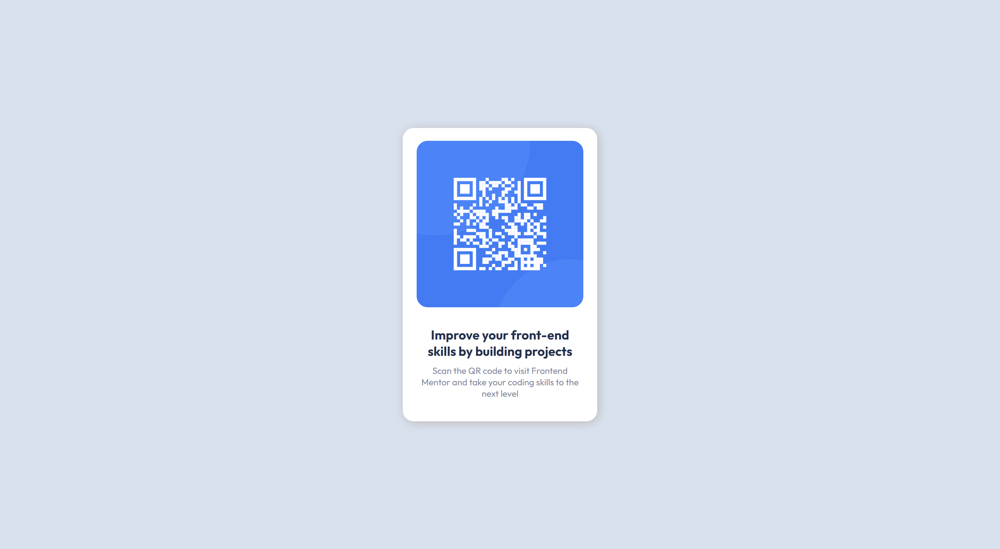

# QR Code card solution

### This is a solution to the [QR code component challenge on Frontend Mentor](https://www.frontendmentor.io/challenges/qr-code-component-iux_sIO_H)

### I have created this project with the purpose of enhancing my website designing skills!

### Built with:
#### - HTML
#### - Scss

## Screenshots

### Desktop

    

### Mobile Phone

    

